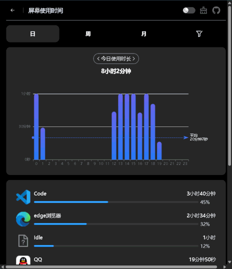

# 屏幕使用时间  

## 功能
统计电脑上不同应用占据最上层窗口时的时间，可以按天、周、月或自定义日期范围去查看统计结果，还可以详细查看某个程序的使用情况  

## 联系方式
QQ群：745018774

## 基础用法
从 Release 下载最新版本的 zip 文件后，解压到合适位置，双击里面的 ScreenTimeTracker.exe”程序就会启动。注意！启动后并不会有窗口，只有一个托盘图标，可能会被系统放到“隐藏的图标菜单”中。  
单击托盘图标或者右键图标并在弹出的菜单中点击“显示界面”就可以看到统计结果。数据更新可能会延迟10秒左右。 
如果希望更精确的控制本程序或者在使用中遇到问题，请查看[进阶用法](#进阶用法)  

## 补充
### 如何配置开机自启动？
1. 同时按下 Win + R 键，输入 shell:startup，点击“确定”或者按下回车，即可打开自启动文件夹  
2. 给想要开机自启动的程序创建一个快捷方式，并把快捷方式放到上一步打开的文件夹中就可以了  
### 为什么有些程序的“描述”和“路径”是空的？
1. 可能是因为这些程序的权限高于我这个程序的权限，导致无法获取这些信息，所以显示为空。解决方法较为复杂，不建议解决。
### 如果更新版本？
1. 程序的数据全部放在根目录下的 Data 文件夹中，只需要把这个文件夹移动到新的版本文件夹中就可以了

## 进阶用法  
程序运行后会读取exe所在目录下的 TrackerSettings.json 配置文件，如果没有或里面的内容不正确就会写入默认设置。设置中的 IntervalMs 表示获取顶层窗口的间隔时间，单位是毫秒，默认是1000毫秒。SaveThreshold 表示获取多少次窗口后写入到数据库中，写入数据库后就可以在统计结果中展示了，默认是10次。  
如果记录到的有些程序的“描述”和“路径”是空，可以用管理员身份运行这个程序，但是程序信息是每天更新一次，所以如果当天已经运行过这个程序，就不会再更新信息，并且如果第二天时没有用管理员身份运行，“描述”和“路径”会被覆盖为空。“补充”中说的方法是无法在开机自启动时以管理员方式运行本程序的，但是你可以上网搜索一些解决方法。  

## 其他
推荐一个详细记录浏览器中不同网站使用时间的浏览器扩展：网费很贵  
他的GitHub：<https://github.com/sheepzh/time-tracker-4-browser>  