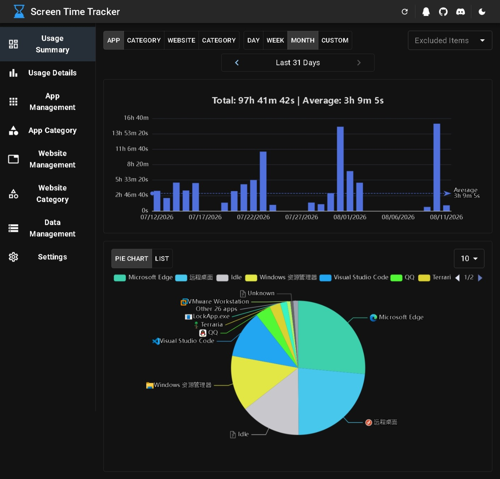
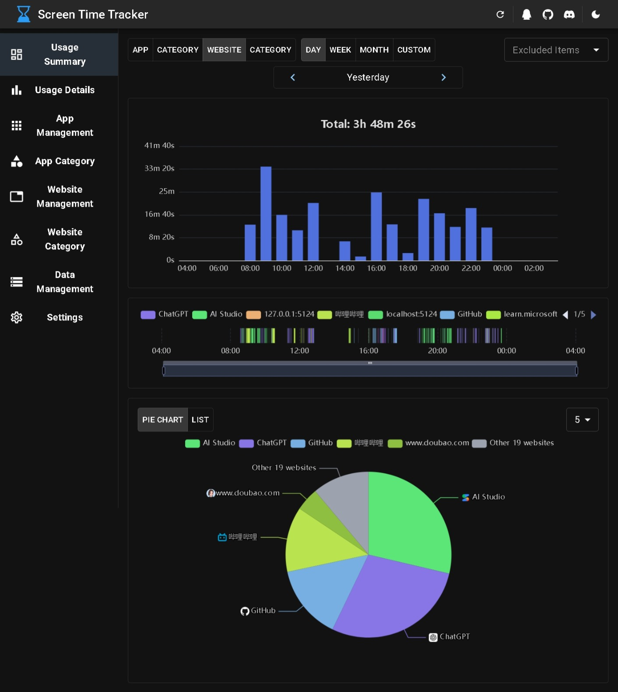
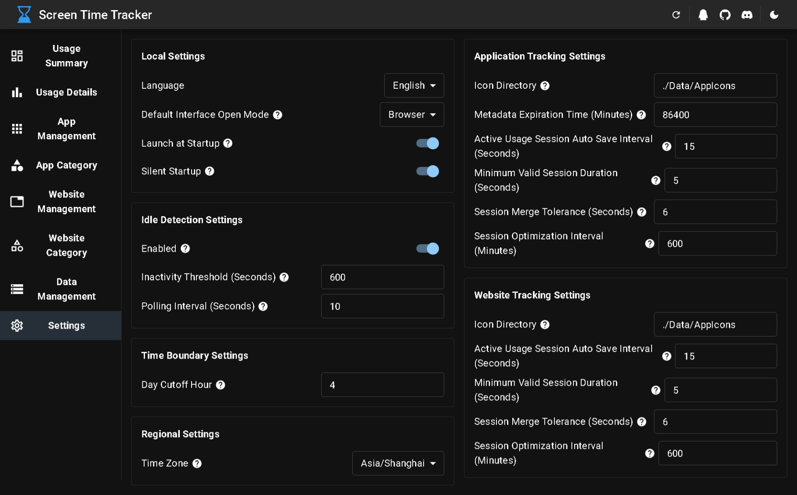
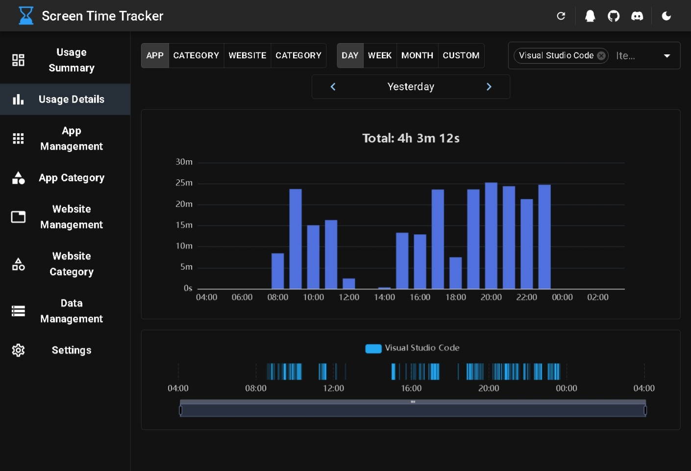

<div align="center">

# Screen Time Tracker

**English** | [简体中文](README_zh-CN.md)

[](https://discord.gg/PxqGwcsVuh) [](https://qm.qq.com/q/uiwJZiQRAm)

</div>

## Overview
A simple and lightweight Windows desktop app for tracking screen time, helping you gain insights into your computer usage, boost productivity, and maintain a healthier work-life balance.

<details>
<summary>Click to view screenshots</summary>
<p align="center">
    
    
    
    
</p>
</details>

## Key Features
- **Time Tracking**: Runs silently in the background, accurately recording the duration spent on each application.
- **Website Usage Statistics**: When used with a browser extension, it can track the amount of time spent on websites.
- **Visual Analytics**: Provides a rich variety of intuitive charts and statistics, allowing you to clearly understand your time distribution.
- **Privacy First**: All data is stored locally and never uploaded to the cloud, guaranteeing your personal privacy.
- **Lightweight & Efficient**: Ultra-low CPU and RAM usage, ensuring it won't impact your daily experience.
- **Highly Configurable**: Offers detailed configuration options to cater to different user requirements.
- **Multilingual Support**: Native support for both English and Simplified Chinese interfaces.

## Download
You can download the application from [Releases](https://github.com/majianchuan/ScreenTimeTracker/releases) or build it yourself.

## Tech Stack
### Backend
* .NET 10.0 (C#)
* ASP.NET Core Web API
* FastEndpoints
* Entity Framework Core
* SQLite
* Mediator
### Frontend
* React
* TypeScript
* Vite
* Material UI (MUI)
* TanStack Query
* TanStack Router
* i18next
* Zod
* ECharts
### Desktop
* Photino.NET
* H.NotifyIcon

## Architecture Overview
The backend follows a Modular Monolith architecture, with individual modules organized using Vertical Slice Architecture.  
The frontend follows Feature-Sliced Design (FSD).  
When the application starts, it launches a local backend API service. The frontend is loaded into the WebView provided by the Photino.NET desktop shell and communicates with the backend through the local API.

## Development
- **Prerequisites**
  - .NET SDK 10.0+
  - Node.js 22.12.0+
- **Clone Repository**:
  ```shell
  git clone https://github.com/majianchuan/ScreenTimeTracker.git
  ```
- **Build Frontend**:
  ```shell
  cd src/frontend
  pnpm install
  pnpm build
  ```
- Build the browser extension (optional):
  ```shell
  cd ../web-extension
  pnpm build
  ```
  The build output will be generated in the `.output` directory.
- **Run Application**:
  ```shell
  cd ../Hosts/ScreenTimeTracker.Desktop
  dotnet run
  ```

## Community & Feedback

If you encounter any issues or have feedback and suggestions, feel free to join our community:

- **Discord Community**: [Join Discord](https://discord.com/invite/PxqGwcsVuh)
- **QQ Group**: [Join QQ Group](https://qm.qq.com/q/uiwJZiQRAm)
