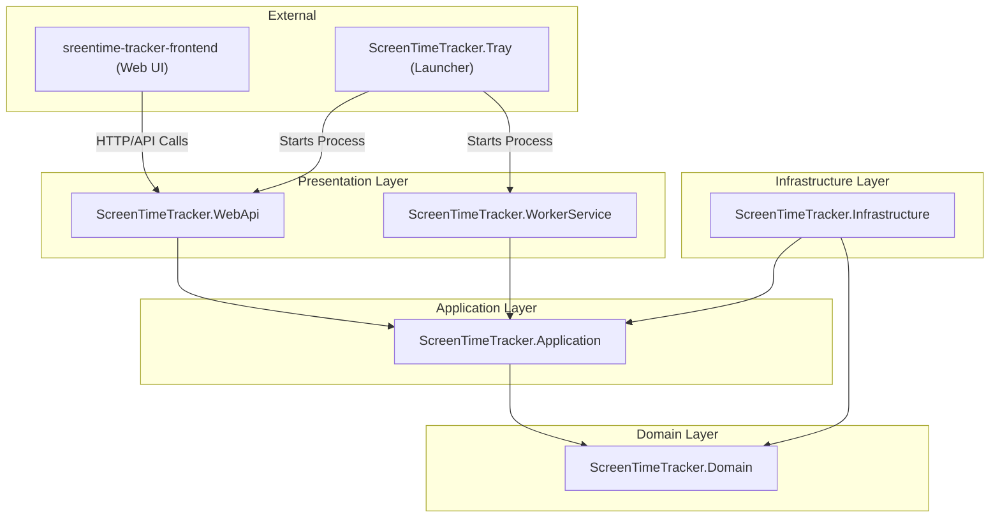

## 项目概述
ScreenTimeTracker，记录电脑屏幕使用时间

## 整体架构

```mermaid
graph TD
    subgraph "External"
        direction TB
        ST_Tray["ScreenTimeTracker.Tray (Launcher)"]
        Vue_Frontend["sreentime-tracker-frontend (Web UI)"]
    end
    subgraph "Presentation Layer"
        direction LR
        ST_WebApi["ScreenTimeTracker.WebApi"]
        ST_WorkerService["ScreenTimeTracker.WorkerService"]
    end
    subgraph "Infrastructure Layer"
        ST_Infrastructure["ScreenTimeTracker.Infrastructure"]
    end
    subgraph "Application Layer"
        ST_Application["ScreenTimeTracker.Application"]
    end
    subgraph "Domain Layer"
        ST_Domain["ScreenTimeTracker.Domain"]
    end

    %% Dependencies
    ST_WebApi --> ST_Application
    ST_WorkerService --> ST_Application
    ST_Application --> ST_Domain
    ST_Infrastructure --> ST_Application
    ST_Infrastructure --> ST_Domain
    Vue_Frontend -- "HTTP/API Calls" --> ST_WebApi
    ST_Tray -- "Starts Process" --> ST_WebApi
    ST_Tray -- "Starts Process" --> ST_WorkerService
```