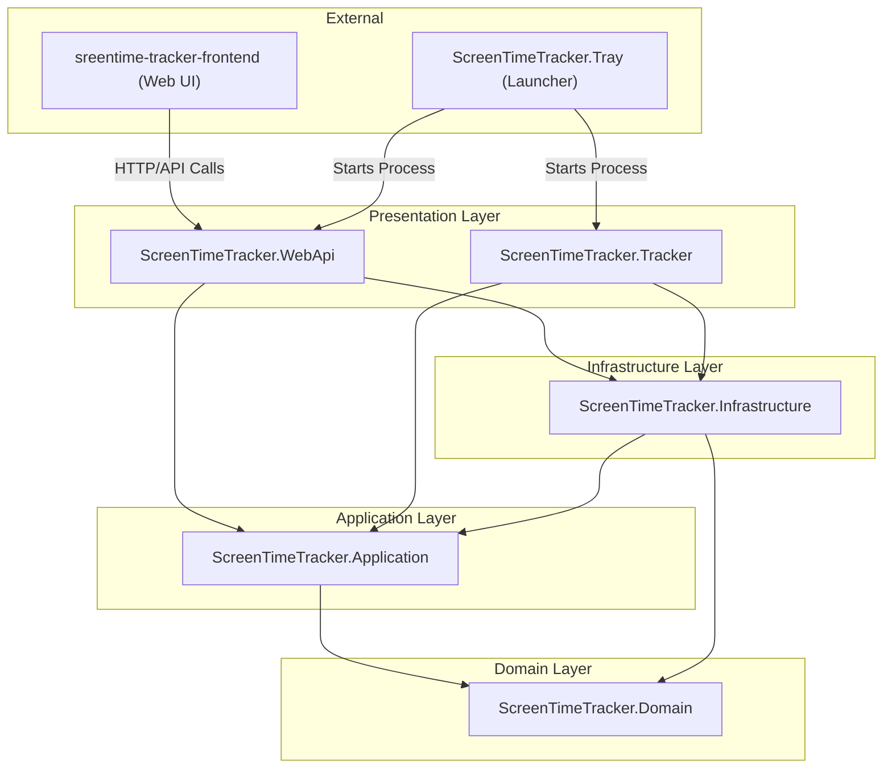

## 项目概述
ScreenTimeTracker，记录电脑屏幕使用时间

## 整体架构


## 技术栈
sreentime-tracker-frontend: Vue3 + Element-Plus + ECharts


## 文件结构
```
ScreenTimeTracker/
├── .gitignore
├── README.md
├── ScreenTimeTracker.sln
├── src/
│   ├── ScreenTimeTracker.Domain/               # 领域实体、枚举、仓储接口
│   │   ├── Entities/
│   │   ├── Enums/
│   │   └── Interfaces/
│   ├── ScreenTimeTracker.Application/          # 业务逻辑、DTOs、应用服务接口
│   ├── ScreenTimeTracker.Infrastructure/       # 数据访问、外部服务实现
│   ├── ScreenTimeTracker.Tracker/              # 后台跟踪服务 (表现层)
│   ├── ScreenTimeTracker.Tray/                 # 托盘启动器
│   └── ScreenTimeTracker.WebApi/               # Web API (表现层)
├── tests/
│   └── ScreenTimeTracker.*.Tests/              # 单元测试
├── frontend/
│   └── screentime-tracker-frontend/            # Vue.js 前端项目
├── docs/
│   ├── class-diagram.md                        # 类图设计文档
│   └── api.md                                  # API文档
└── publish/
    └── ScreenTimeTracker/                      # 发布目录
```
