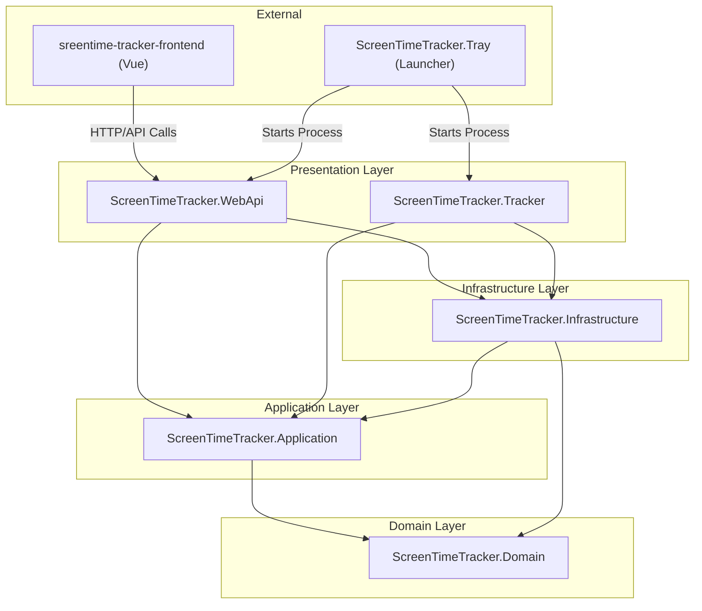
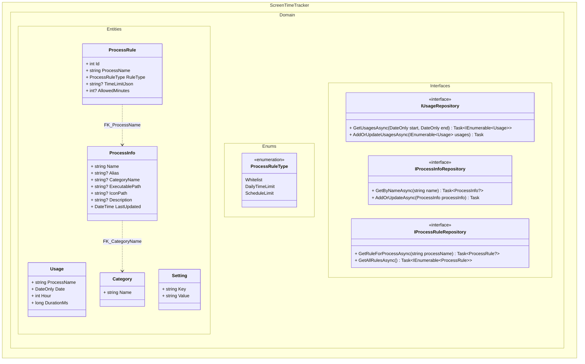
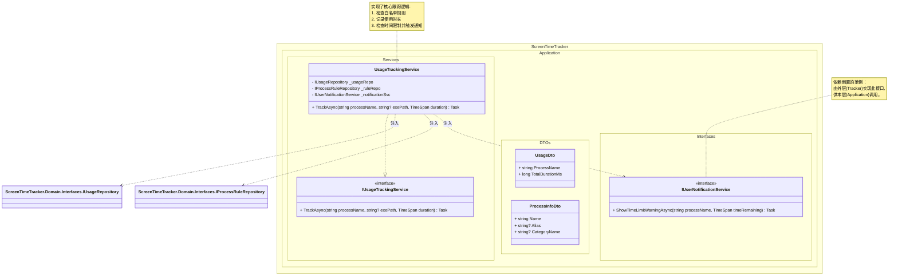
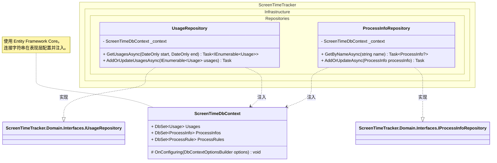
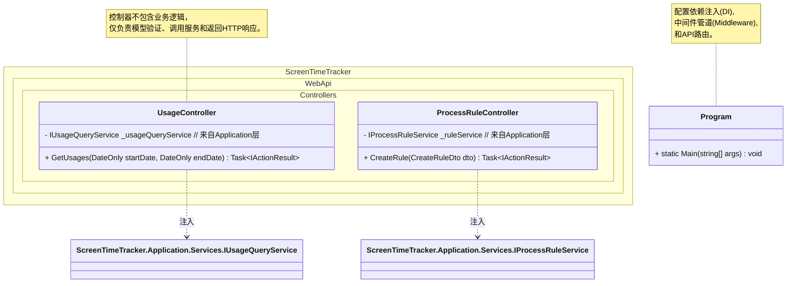
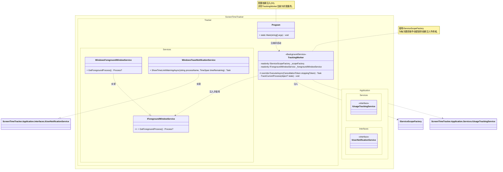

# 类图设计文档

## 项目概述
ScreenTimeTracker，记录电脑屏幕使用时间

## 整体架构


## 文件结构
```
ScreenTimeTracker/
├── .gitignore
├── README.md
├── ScreenTimeTracker.sln
├── src/
│   ├── ScreenTimeTracker.Application/  # 业务逻辑、DTOs、应用服务接口
│   ├── ScreenTimeTracker.Domain/       # 领域实体、枚举、仓储接口
│   ├── ScreenTimeTracker.Infrastructure/ # 数据访问、外部服务实现
│   ├── ScreenTimeTracker.Tracker/      # 后台跟踪服务 (表现层)
│   ├── ScreenTimeTracker.Tray/         # 托盘启动器
│   └── ScreenTimeTracker.WebApi/       # Web API (表现层)
├── frontend/
│   └── screentime-tracker-frontend/    # Vue.js 前端项目
├── docs/                                 # 项目文档
└── tests/                                # 测试项目
    ├── ScreenTimeTracker.Domain.Tests/     # 领域模型单元测试
    ├── ScreenTimeTracker.Application.Tests/  # 应用服务单元测试 (可Mock仓储)
    └── ScreenTimeTracker.Integration.Tests/  # (可选) 集成测试
```

## Domain 类图


## Application 类图  


## Infrastructure 类图


## WebApi 类图


## Tracker 类图
每隔一小段时间获取一次顶层窗口的进程名作为正在使用的程序
每隔几次获取顶层窗口的进程名，写入获取后写入到数据库，防止频繁调用数据库导致性能问题
