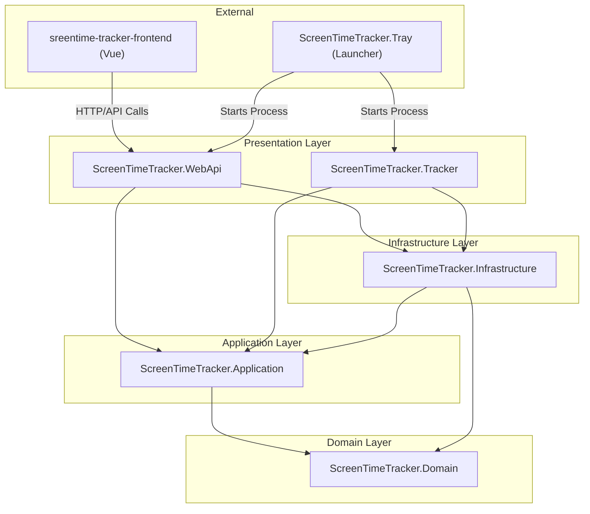
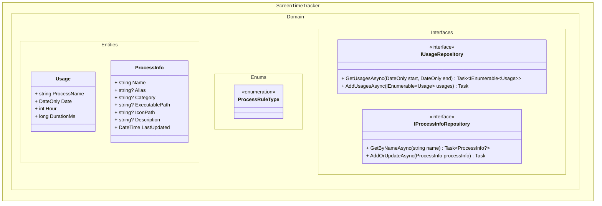
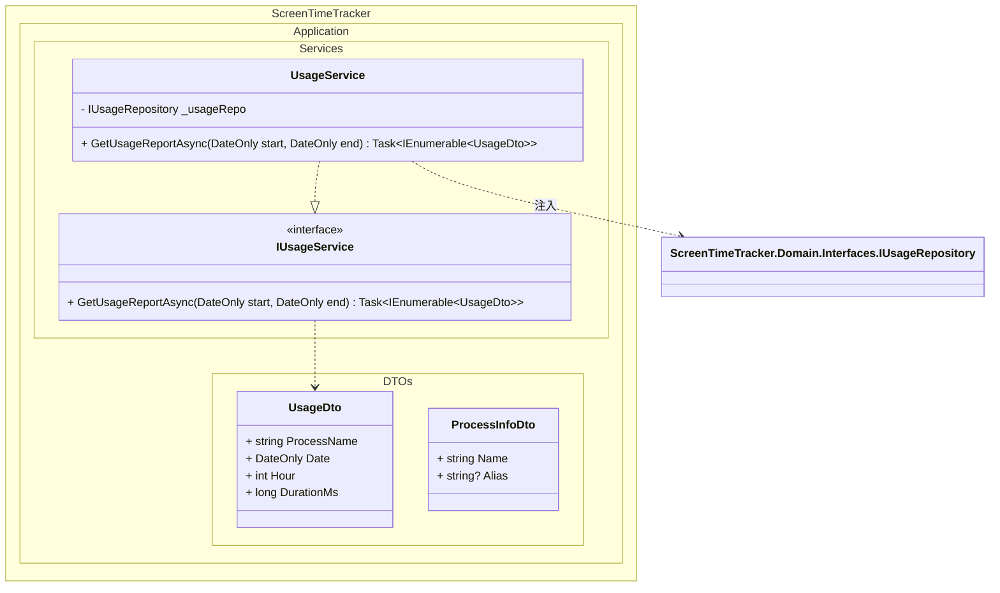
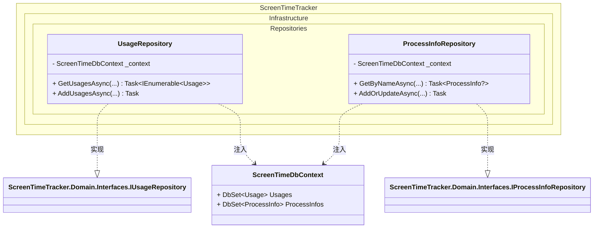
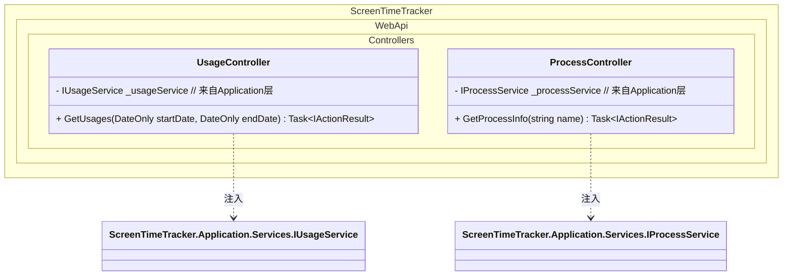

# 类图设计文档

## 项目概述
ScreenTimeTracker，记录电脑屏幕使用时间

## 整体架构


## 文件结构
```
ScreenTimeTracker/
├── .gitignore
├── README.md
├── ScreenTimeTracker.sln
├── src/
│   ├── ScreenTimeTracker.Application/ 
│   ├── ScreenTimeTracker.Domain/ 
│   ├── ScreenTimeTracker.Infrastructure/     
│   ├── ScreenTimeTracker.Tracker/
│   ├── ScreenTimeTracker.Tray/ 
│   └── ScreenTimeTracker.WebApi/ 
├── frontend/
│   ├── screentime-tracker-frontend/    
│   │   ├── public/
│   │   ├── src/
│   │   ├── vite.config.js
│   └   └── ...
├── docs/
└── tests/
```

## Domain 类图


## Application 类图  


## Infrastructure 类图


## WebApi 类图

