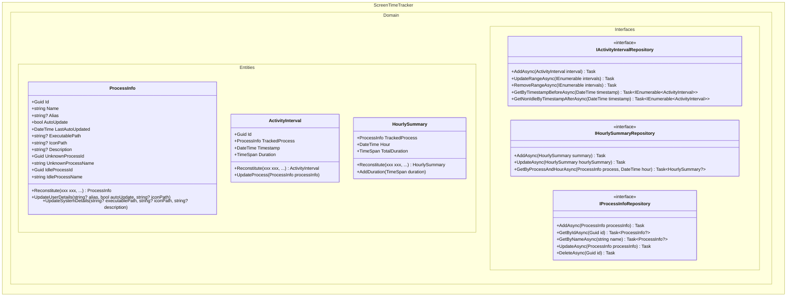
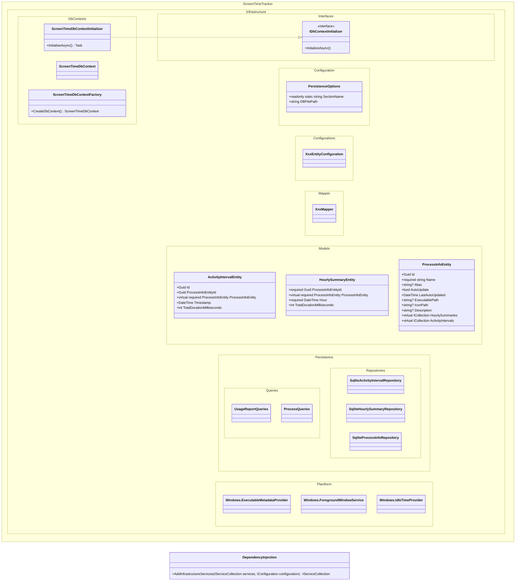
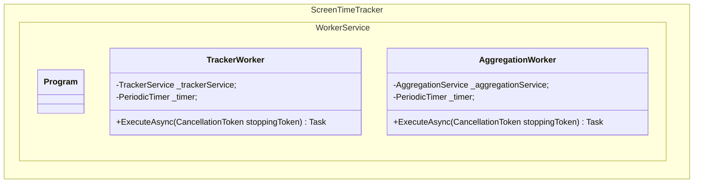
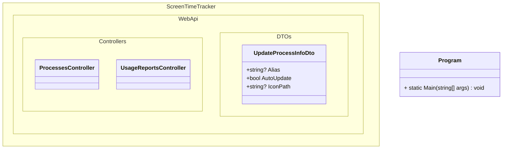
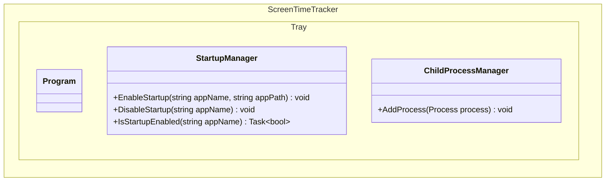

# 设计细节

## Domain

```mermaid 
classDiagram
    namespace ScreenTimeTracker.Domain.Entities {
        class ProcessInfo {
            +Guid Id
            +string Name
            +string? Alias
            +bool AutoUpdate
            +DateTime LastAutoUpdated
            +string? ExecutablePath
            +string? IconPath
            +string? Description
            +Reconstitute(xxx xxx, ...) ProcessInfo
            +UpdateUserDetails(string? alias, bool autoUpdate, string? iconPath)
            +UpdateSystemDetails(string? executablePath, string? iconPath, string? description)
            +Guid UnknownProcessId
            +string UnknownProcessName
            +Guid IdleProcessId
            +string IdleProcessName
        }
        class ActivityInterval {
            +Guid Id
            +ProcessInfo TrackedProcess
            +DateTime Timestamp
            +TimeSpan Duration
            +Reconstitute(xxx xxx, ...) ActivityInterval
            +UpdateProcess(ProcessInfo processInfo)
        }
        class HourlySummary {
            +ProcessInfo TrackedProcess
            +DateTime Hour
            +TimeSpan TotalDuration
            +Reconstitute(xxx xxx, ...) HourlySummary
            +AddDuration(TimeSpan duration)
        }
    }

    namespace ScreenTimeTracker.Domain.Interfaces {
        class IActivityIntervalRepository {
            <<interface>>
            +AddAsync(ActivityInterval interval) Task
            +UpdateRangeAsync(IEnumerable<ActivityInterval> intervals) Task
            +RemoveRangeAsync(IEnumerable<ActivityInterval> intervals) Task
            +GetByTimestampBeforeAsync(DateTime timestamp) Task~IEnumerable~ActivityInterval~~
            +GetNonIdleByTimestampAfterAsync(DateTime timestamp) Task~IEnumerable~ActivityInterval~~
        }
        class IHourlySummaryRepository {
            <<interface>>
            +AddAsync(HourlySummary summary) Task
            +UpdateAsync(HourlySummary hourlySummary) Task
            +GetByProcessAndHourAsync(ProcessInfo process, DateTime hour) Task~HourlySummary?~
        }
        class IProcessInfoRepository {
            <<interface>>
            +AddAsync(ProcessInfo processInfo) Task
            +GetByIdAsync(Guid id) Task~ProcessInfo?~
            +GetByNameAsync(string name) Task~ProcessInfo?~
            +UpdateAsync(ProcessInfo processInfo) Task
            +DeleteAsync(Guid id) Task
        }
    }
```

## Application  

```mermaid 
classDiagram
    direction TB
    namespace ScreenTimeTracker.Application.Configuration {
        class TrackerOptions {
            +readonly static string SectionName
            +double PollingIntervalMilliseconds
            +double ProcessInfoStaleThresholdMinutes
            +required string ProcessIconDirPath
            +double IdleTimeoutMinutes
        }
        class AggregationOptions {
            +readonly static string SectionName
            +double PollingIntervalMinutes
        }
    }
    namespace ScreenTimeTracker.Application.DTOs {
        class ExecutableMetadata {
            <<record>>
            +string? Description,
            +byte[]? IconBytes,
            +string? FileExtension
        }
        class ProcessInfoDto {
            <<record>>
            +Guid Id
            +string? Alias
            +bool AutoUpdate
            +string LastAutoUpdated
            +string? ExecutablePath
            +string? IconPath
            +string? Description
        }
        class ProcessUsageRankEntry {
            <<record>>
            +Guid ProcessId
            +string ProcessName
            +string? ProcessAlias
            +string? ProcessIconPath
            +TimeSpan TotalDuration
            +int Percentage
        }
    }
    namespace ScreenTimeTracker.Application.Interfaces {
        class IExecutableMetadataProvider {
            <<interface>>
            +GetMetadataAsync(string executablePath) Task~ExecutableMetadata?~
        }
        class IForegroundWindowService{
            <<interface>>
            +GetForegroundProcess() Task~ProcessInfo?~
        }
        class IIdleTimeProvider {
            <<interface>>
            +GetSystemIdleTimeAsync() Task~TimeSpan~
        }
        class IUsageReportQueries {
            <<interface>>
            +GetRankedProcessUsageForPeriodAsync(DateOnly startDate, DateOnly endDate, int topN, IEnumerable~Guid~? excludedProcessIds) Task~IEnumerable~ProcessUsageRankEntry~~
            +GetTotalHourlyUsageForDayAsync(DateOnly date, IEnumerable~Guid~? excludedProcessIds) Task~IDictionary~int,long~~
            +GetTotalDailyUsageForPeriodAsync(DateOnly startDate, DateOnly endDate, IEnumerable~Guid~? excludedProcessIds) Task~IDictionary~DateOnly,long~~
            +GetProcessHourlyDistributionForDayAsync(DateOnly date, Guid processId) Task~IDictionary~int,long~~
            +GetProcessDailyDistributionForPeriodAsync(DateOnly startDate, DateOnly endDate, Guid processId) Task~IDictionary~DateOnly,long~~
        }
        class IProcessQueries {
            <<interface>>
            +GetAllProcessesAsync(CancellationToken cancellationToken) Task~IEnumerable~ProcessInfoDto~~
            +GetProcessIconByIdAsync(Guid processId, CancellationToken cancellationToken) Task~string?~
            +GetProcessByIdAsync(Guid id, CancellationToken cancellationToken) Task~ProcessInfoDto?~
        }
    }
    namespace ScreenTimeTracker.Application.Services {
        class AggregationService {
            +SummarizeHourlyDataAsync()
        }
        class TrackerService {
            +RecordActivityIntervalAsync() Task
        }
        class ProcessManagementService {
            +GetIdleProcessAsync() Task~ProcessInfo~
            +GetUnknownProcessAsync() Task~ProcessInfo~
            +EnsureProcessInfoExistsAsync(Process process) Task~ProcessInfo~
        }
    }
    class DependencyInjection {
        +AddApplicationServices(IServiceCollection services) IServiceCollection
    }

    TrackerService ..> ProcessManagementService
    TrackerService ..> IForegroundWindowService
    TrackerService ..> IIdleTimeProvider
    ProcessManagementService ..> IExecutableMetadataProvider
    Processes.Queries.GetAllProcessesQueryHandler ..> IProcessQueries
```

## Infrastructure

```mermaid 
classDiagram
    direction LR
    namespace ScreenTimeTracker.Infrastructure.Interfaces {
        class IDbContextInitializer {
            <<interface>>
            +InitializeAsync()
        }
    }
    namespace ScreenTimeTracker.Infrastructure.Configuration {
        class PersistenceOptions {
            +readonly static string SectionName
            +string DBFilePath
        }
    }
    namespace ScreenTimeTracker.Infrastructure.Configurations {
        class XxxEntityConfiguration {
        }
    }
    namespace ScreenTimeTracker.Infrastructure.DbContexts {
        class ScreenTimeDbContext {
        }
        class ScreenTimeDbContextFactory {
            +CreateDbContext() ScreenTimeDbContext
        }
        class ScreenTimeDbContextInitializer {
            +InitialiseAsync() Task
        }
    }
    namespace ScreenTimeTracker.Infrastructure.Mapper {
        class XxxMapper {
        }
    }
    namespace ScreenTimeTracker.Infrastructure.Models {
        class ActivityIntervalEntity {
            +Guid Id
            +Guid ProcessInfoEntityId
            +virtual required ProcessInfoEntity ProcessInfoEntity
            +DateTime Timestamp
            +int TotalDurationMilliseconds
        }
        class HourlySummaryEntity {
            +required Guid ProcessInfoEntityId
            +virtual required ProcessInfoEntity ProcessInfoEntity
            +required DateTime Hour
            +int TotalDurationMilliseconds
        }
        class ProcessInfoEntity {
            +Guid Id
            +required string Name
            +string? Alias
            +bool AutoUpdate
            +DateTime LastAutoUpdated
            +string? ExecutablePath
            +string? IconPath
            +string? Description
            +virtual ICollection<HourlySummaryEntity> HourlySummaries
            +virtual ICollection<ActivityIntervalEntity> ActivityIntervals
        }
    }
    namespace ScreenTimeTracker.Infrastructure.Persistence.Queries {
        class UsageReportQueries {
        }
        class ProcessQueries {
        }
    }
    namespace ScreenTimeTracker.Infrastructure.Persistence.Repositories {
        class SqliteActivityIntervalRepository {
        }
        class SqliteHourlySummaryRepository {
        }
        class SqliteProcessInfoRepository {
        }
    }
    namespace ScreenTimeTracker.Infrastructure.Plantform {
        class Windows.ExecutableMetadataProvider {
        }
        class Windows.ForegroundWindowService {
        }
        class Windows.IdleTimeProvider {
        }
    }
    class DependencyInjection {
        +AddInfrastructureServices(IServiceCollection services, IConfiguration configuration) IServiceCollection
    }

    ScreenTimeDbContextInitializer ..|> IDbContextInitializer
```

## WorkerService

```mermaid 
classDiagram
    direction TB
    namespace ScreenTimeTracker.WorkerService {
        class Program {
        }
        class TrackerWorker {
            -TrackerService _trackerService;
            -PeriodicTimer _timer;
            +ExecuteAsync(CancellationToken stoppingToken) Task
        }
        class AggregationWorker {
            -AggregationService _aggregationService;
            -PeriodicTimer _timer;
            +ExecuteAsync(CancellationToken stoppingToken) Task
        }
    }

```

## WebApi

```mermaid 
classDiagram
    direction TB
    class Program {
        + static Main(string[] args) void
    }
    namespace ScreenTimeTracker.WebApi.Controllers {
        class ProcessesController {
        }
        class UsageReportsController{
        }
    }
    namespace ScreenTimeTracker.WebApi.DTOs {
        class UpdateProcessInfoDto {
            +string? Alias
            +bool AutoUpdate
            +string? IconPath
        }
    }
```

## Tray

```mermaid 
classDiagram
    direction TB
    namespace ScreenTimeTracker.Tray {
        class Program {
        }
        class StartupManager {
            +EnableStartup(string appName, string appPath) void
            +DisableStartup(string appName) void
            +IsStartupEnabled(string appName) Task~bool~
        }
        class ChildProcessManager {
            +AddProcess(Process process) void
        }
    }
```